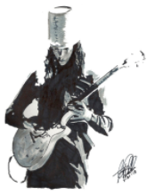

<p align="center"></p>

<h1 align="center">The Buckethead</h1>

[](https://github.com/IuryChagas/buckethead/blob/master/LICENSE.md)

> A modern website to honor one of the greatest guitarists of all time.

## Versioning

To keep better organization of releases we follow the [Semantic Versioning 2.0.0](http://semver.org/) guidelines.

## Contributing

▸ You can help us develop it! [Follow these recommendations](https://github.com/IuryChagas/buckethead/blob/master/CONTRIBUTING.md).<br>
▸ Find on our [Roudmap](https://github.com/IuryChagas/buckethead/issues/) the next steps of the project.<br>
▸ Follow The [Code Standards Guide](https://github.com/IuryChagas/style-guide-compilation#directory-structure "Guia Basico de Estilo HTML e CSS"), This is your reference to code like us.

## Folders and Files

```sh
├── README.md
├── CONTRIBUTING.md
├── LICENSE.md
├──:build
│    ├──:css
│    │   └── main.css
│    ├──:img
│    │   └── logo-rm.png
│    ├──:js
│    │   └── main.js
│    └── index.html
└──:src
    ├──:img
    ├──:js
    └──:styl
    	├──:base
    	├──:components
    	├──:layout
    	├──:states
        └──:template
```
Those folders and file will change during the project.

## License

[MIT License](https://github.com/iurychagas/buckethead/blob/master/LICENSE.md) © [Iury Chagas](https://github.com/IuryChagas "GitHub Profile")